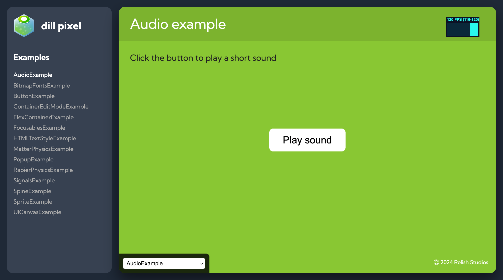

import { CardGrid, LinkCard } from '@astrojs/starlight/components';

We've created a handful of examples to help you get started with dill pixel.
The source code for the examples can be found in the [GitHub repository](https://github.com/relishinc/dill-pixel/tree/main/packages/examples)

<CardGrid>
  <LinkCard
    title="Example Gallery"
    description="Demonstrating a wide range of features and concepts"
    href="https://dillpixel.io/examples/"
  />
  <LinkCard
    title="Source Code"
    description="Available in the GitHub repository"
    href="https://github.com/relishinc/dill-pixel/tree/main/packages/examples"
  />
</CardGrid>
