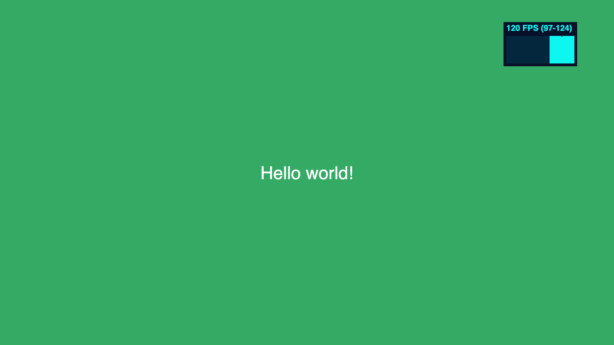

import {TabItem, Tabs, Aside, FileTree, Code, Steps} from '@astrojs/starlight/components';

import packageJson from '../../../../examples/hello-world/package.json?raw';
import indexHtml from '../../../../examples/hello-world/index.html?raw';
import indexCss from '../../../../examples/hello-world/src/index.css?raw';
import indexTs from '../../../../examples/hello-world/src/index.ts?raw';
import applicationTs from '../../../../examples/hello-world/src/Application.ts?raw';
import loadScreenTs from '../../../../examples/hello-world/src/state/LoadScreen.ts?raw';
import myScreenTs from '../../../../examples/hello-world/src/state/MyScreen.ts?raw';

## Installing the Framework

Make sure you have an up-to-date version of [Node.js](https://nodejs.org/) installed and your current working directory is the one where you intend to create a project. Run the following command in your command line:

<Tabs>
	<TabItem label={"npm"}>
		```bash
		npm i dill-pixel
		```
	</TabItem>
	<TabItem label={"yarn"}>
		```bash
		yarn add dill-pixel
		```
	</TabItem>
	<TabItem label={"pnpm"}>
		```bash
		pnpm install dill-pixel
		```
	</TabItem>
</Tabs>

## "Hello World" Example

The most basic example of a dill pixel game is a simple "Hello World" message. Let's get started...



### Create the Files

<Steps>

1. First, create a `package.json` in your project's root directory:

	<Code code={packageJson} lang="json" title="package.json" />

	<Aside type="tip">
		We recommend using [Vite](https://vitejs.dev) to develop locally and bundle your application
	</Aside>

2. Next, create an `index.html` file in the root directory:

	<Code code={indexHtml} lang="html" title="index.html" />

3. Create an `index.css` file in the `src` directory:

	<Code code={indexCss} lang="css" title="src/index.css" />

4. Create the remaining files in the `src` directory:

	<Tabs>
		<TabItem label="src/index.ts">
			<Code code={indexTs} lang="ts" />
		</TabItem>
		<TabItem label="src/Application.ts">
			<Code code={applicationTs} lang="ts" />
		</TabItem>
		<TabItem label="src/state/LoadScreen.ts">
			<Code code={loadScreenTs} lang="ts" />
		</TabItem>	
		<TabItem label="src/state/MyScreen.ts">
			<Code code={myScreenTs} lang="ts" />
		</TabItem>		
	</Tabs>

</Steps>

Your project directory should look like this:

<FileTree>

- package.json
- index.html
- **src**
		- index.css	  
	- index.ts
	- Application.ts
	- state
		- LoadScreen.ts
		- MyScreen.ts		

</FileTree>

<Aside type="tip">
	The entire source code for this example can be found in the [GitHub repository](https://github.com/relishinc/dill-pixel/tree/main/docs/examples/hello-world)
</Aside>

### Install the Dependencies

Once you have created the files, install the dependencies:

<Tabs>
	<TabItem label={"npm"}>
		```bash
		npm install
		```
	</TabItem>
	<TabItem label={"yarn"}>
		```bash
		yarn install
		```
	</TabItem>
	<TabItem label={"pnpm"}>
		```bash
		pnpm install
		```
	</TabItem>
</Tabs>

### Start the Dev Server

<Tabs>
	<TabItem label={"npm"}>
		```bash
		npm run dev
		```
	</TabItem>
	<TabItem label={"yarn"}>
		```bash
		yarn dev
		```
	</TabItem>
	<TabItem label={"pnpm"}>
		```bash
		pnpm run dev
		```
	</TabItem>
</Tabs>

### Build for Production

<Tabs>
	<TabItem label={"npm"}>
		```bash
		npm run build
		```
	</TabItem>
	<TabItem label={"yarn"}>
		```bash
		yarn build
		```
	</TabItem>
	<TabItem label={"pnpm"}>
		```bash
		pnpm run build
		```
	</TabItem>
</Tabs>


